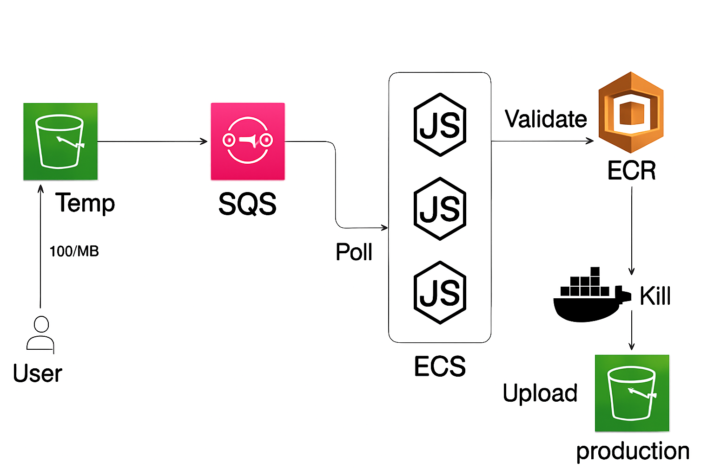

# 🎮 Video Transcoding Pipeline (AWS ECS + S3 + SQS)

This project implements a scalable, serverless video transcoding pipeline using AWS ECS, S3, and SQS — similar to how Mux or AWS Elastic Transcoder works, but fully customizable.

---

## 📌 Architecture



### Flow

1. **User Uploads Video**

   * Users upload raw video files to a **temporary S3 bucket** (`temp-bucket`).
   * Pricing note: `100/MB` in the diagram refers to estimated storage/transfer cost.

2. **S3 Event → SQS Notification**

   * An S3 PUT event triggers an SQS message containing:

     * S3 bucket name
     * Object key (video path)
     * Any metadata needed (resolution profiles, job ID, etc.)

3. **SQS → ECS Task**

   * An ECS service continuously polls SQS for new jobs.
   * When a new message arrives, ECS launches a container task to process the file.

4. **ECS Processing**

   * Container fetches the file from **Temp S3**.
   * Transcodes it to multiple resolutions using `ffmpeg`.
   * Validates the job configuration from ECR (Docker image registry).
   * Uploads final outputs to the **Production S3 bucket**.

5. **ECS Task Cleanup**

   * Once uploads are successful:

     * ECS task stops (no wasted resources).
     * Temporary local/transcoding files are removed.

---

## 🛠️ Tech Stack

* **AWS S3** — File storage (Temp + Production buckets)
* **AWS SQS** — Job queue between upload and processing
* **AWS ECS (Fargate)** — Runs transcoding containers on demand
* **AWS ECR** — Stores container images with ffmpeg and processing scripts
* **Node.js** — ECS task logic & AWS SDK integration
* **ffmpeg** — Video transcoding
* **dotenv** — Manage environment variables

---

## 🚀 Getting Started

### 1️⃣ Prerequisites

* Node.js >= 18
* AWS CLI configured with credentials
* Docker (for building the ECS task image)
* An AWS account with S3, SQS, ECS, and ECR access

### 2️⃣ Setup

```bash
# Clone the repo
git clone https://github.com/yourusername/video-transcoder.git
cd video-transcoder

# Install dependencies
npm install

# Create a .env file
cat <<EOF > .env
BUCKET_NAME_TEMP=temp-bucket-name
BUCKET_NAME_PROD=prod-bucket-name
SQS_QUEUE_URL=https://sqs.us-east-1.amazonaws.com/123456789012/queue-name
ECS_CLUSTER=video-transcoder-cluster
ECS_TASK_DEF=video-transcoder-task:1
AWS_REGION=us-east-1
EOF
```

### 3️⃣ Build & Push ECS Image

```bash
docker build -t video-transcoder .
docker tag video-transcoder:latest <AWS_ACCOUNT_ID>.dkr.ecr.us-east-1.amazonaws.com/video-transcoder:latest
aws ecr get-login-password --region us-east-1 | docker login --username AWS --password-stdin <AWS_ACCOUNT_ID>.dkr.ecr.us-east-1.amazonaws.com
docker push <AWS_ACCOUNT_ID>.dkr.ecr.us-east-1.amazonaws.com/video-transcoder:latest
```

### 4️⃣ Deploy ECS Task

Update your ECS service or run on-demand:

```bash
aws ecs run-task \
  --cluster $ECS_CLUSTER \
  --launch-type FARGATE \
  --task-definition $ECS_TASK_DEF \
  --network-configuration "awsvpcConfiguration={subnets=[subnet-abc123],assignPublicIp=ENABLED}"
```

---

## 🗂️ Project Structure

```
├── index.js             # Main ECS task code
├── Dockerfile           # ffmpeg-enabled Node.js container
├── package.json
├── .env.example         # Example env vars
├── README.md
└── /scripts             # Helper scripts
```

---

## 📜 Features

✅ Automatic scaling (ECS Fargate)
✅ Multiple output resolutions (configurable in RESOLUTIONS array)
✅ S3 → SQS → ECS → S3 fully decoupled
✅ ECR-based container validation before execution
✅ Upload & cleanup automation

---

## 🔒 Security Notes

* Never commit real AWS credentials or `.env` files.
* Store sensitive values in AWS Secrets Manager or SSM Parameter Store.
* Use IAM roles for ECS tasks with least privilege.

---

## 📊 Next Steps

* Add CloudWatch logs & metrics
* Implement retry logic for failed jobs
* Use S3 signed URLs for upload/download
* Add thumbnail generation and metadata extraction
